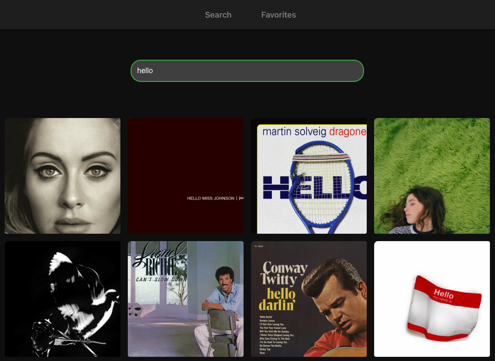

# Music Player 
## Project Branches

This repository contains two main branches:
- `app-version`: Contains the React Native mobile application version
- `web-version`: Contains the React web application version (current documentation)

# Web Application

A modern web-based music player application built with React and the Spotify Web API. This application allows users to search for tracks, preview songs, and manage favorites with a sleek, iTunes-inspired interface.


*iTunes-inspired grid layout with hover effects and preview functionality*

Choose the appropriate branch based on your needs:
```bash
# For web version
git clone -b web-version https://github.com/calanuzao/musicplayer.git

# For mobile version
git clone -b main https://github.com/calanuzao/musicplayer.git
```

## Features

- 🔍 Real-time track search with debounced input
- 🎵 Audio preview functionality
- 💟 Favorite tracks management
- 📱 Responsive grid layout
- 🎨 Modern, iTunes-inspired design
- 🔄 Smooth animations and transitions

## Installation

1. Clone the repository:
```bash
git clone https://github.com/calanuzao/musicplayer.git
cd musicplayer
```

2. Install dependencies:
```bash
npm install
```

3. Create a `.env` file in the root directory and add your Spotify API credentials:
```
REACT_APP_SPOTIFY_CLIENT_ID=your_client_id_here
REACT_APP_SPOTIFY_CLIENT_SECRET=your_client_secret_here
```

4. Start the development server:
```bash
npm start
```

## Design Decisions

### Technology Stack
- **React**: Chosen for its component-based architecture and efficient rendering
- **TypeScript**: Adds type safety and improves development experience
- **Spotify Web API**: Provides access to a vast music library and metadata
- **CSS Modules**: Ensures style encapsulation and maintainable CSS

### UI/UX Considerations
- iTunes-inspired grid layout for familiarity and visual appeal
- Debounced search for optimal performance
- Hover effects and animations for better user interaction
- Dark theme for reduced eye strain
- Responsive design for various screen sizes

## Libraries Used

- `react-router-dom`: For client-side routing
- `axios`: For HTTP requests
- `react-icons`: For consistent and scalable icons
- `lodash.debounce`: For search input optimization

## Known Limitations & Future Improvements

### Current Limitations
- Preview playback limited to 30 seconds (Spotify API restriction)
- No user authentication system
- Limited offline functionality
- No playlist management

### Future Improvements
1. **Authentication & User Profiles**
   - Implement Spotify OAuth
   - Save user preferences
   - Sync favorites across devices

2. **Enhanced Playback**
   - Full-track playback for premium users
   - Queue management
   - Crossfade between tracks
   - Equalizer settings

3. **Additional Features**
   - Playlist creation and management
   - Advanced search filters
   - Lyrics display
   - Social sharing options

4. **Performance Optimization**
   - Implement virtual scrolling for large result sets
   - Add service worker for offline capability
   - Optimize image loading with lazy loading

5. **UI Enhancements**
   - Light/dark theme toggle
   - Customizable grid layouts
   - More animation options
   - Accessibility improvements

## Contributing

Contributions are welcome! Please feel free to submit a Pull Request.

## License

This project is licensed under the MIT License - see the LICENSE file for details.
